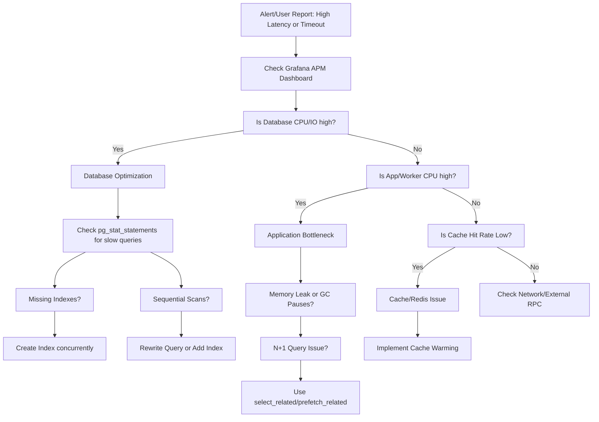

# Performance Troubleshooting Playbook

This playbook provides a systematic approach to diagnosing and fixing performance bottlenecks in the SoroScan architecture. 

## 1. Troubleshooting Flowchart

Use the following flowchart to isolate the source of performance degradation:



## 2. Common Bottlenecks

### Database (PostgreSQL)
* **Missing Indexes:** The most common cause of slow API endpoints. Ensure `contract_id` and `ledger_seq` are indexed.
* **Sequential Scans:** Queries that scan the entire `EventRecord` table instead of using an index.
* **Connection Exhaustion:** Too many open connections from Celery workers or Django. Use PgBouncer.

### Application (Django / Celery)
* **N+1 Queries:** Looping over records and making a DB query for each one inside the ORM.
* **Synchronous RPC Calls:** Making blocking HTTP calls to the Soroban RPC inside the hot path.
* **Memory Leaks:** Unbounded memory growth in Celery workers.

### Cache (Redis)
* **Low Hit Rate:** Frequently accessed data (like latest ledgers) dropping out of the cache.
* **Eviction Storms:** Too much data stored in Redis, causing random evictions.

## 3. Monitoring Dashboards to Check

When an incident occurs, review the following metrics in **Grafana / Datadog**:

### Core Metrics Reference
| Metric Name | Threshold / Warning Level | Indicates |
|-------------|---------------------------|-----------|
| `api.request.latency.p95` | > 500ms | General API slowdown |
| `db.connections.active` | > 80% of max | PgBouncer/Connection pool exhaustion |
| `db.query.execution_time` | > 100ms | Missing indexes or complex joins |
| `celery.queue.backlog` | > 5,000 items | Workers cannot keep up with event ingestion |
| `redis.cache.hit_rate` | < 80% | Cache invalidation issues or cold cache |

## 4. Database Query Optimization

Use PostgreSQL's `pg_stat_statements` to find the most expensive queries.

### Finding Slow Queries
```sql
SELECT query, 
       calls, 
       total_exec_time / calls AS avg_time_ms, 
       rows / calls AS avg_rows
FROM pg_stat_statements
ORDER BY avg_time_ms DESC
LIMIT 10;
```

### Fixing N+1 Queries (Django ORM)

**❌ Bad:**
```python
# Causes 1 query for the events, and N queries for the transaction details
events = EventRecord.objects.filter(contract_id="CC...123")
for event in events:
    print(event.transaction.fee) 
```

**✅ Good:**
```python
# Causes 1 query with a JOIN
events = EventRecord.objects.select_related('transaction').filter(contract_id="CC...123")
for event in events:
    print(event.transaction.fee)
```

### Adding Indexes Concurrently
Always build indexes concurrently to avoid locking tables in production:
```sql
CREATE INDEX CONCURRENTLY idx_event_contract_ledger 
ON ingest_eventrecord(contract_id, ledger_seq DESC);
```

## 5. Cache Warming Strategies

When deploying new code or restarting Redis, the cache will be "cold," leading to a sudden spike in database load.

### Pre-computing the Latest Ledger
Run a background Celery beat task to keep the latest global ledger state warm.
```python
@shared_task
def warm_latest_ledger_cache():
    latest_ledger = Ledger.objects.order_by('-sequence').first()
    if latest_ledger:
        cache.set('latest_ledger_state', latest_ledger.to_dict(), timeout=60)
```

### Predictive Cache Warming
If a user frequently queries a specific smart contract, asynchronously pre-fetch the next page of events into Redis before they request it.

## 6. Load Testing Procedures

Before releasing major ingestion or API changes, validate performance using **Locust** or **k6**.

### Running a k6 Load Test
Create a `load-test.js` script to simulate API consumers:

```javascript
import http from 'k6/http';
import { check, sleep } from 'k6';

export const options = {
  stages: [
    { duration: '30s', target: 50 }, // Ramp up to 50 users
    { duration: '1m', target: 50 },  // Stay at 50 users
    { duration: '30s', target: 0 },  // Ramp down
  ],
};

export default function () {
  const res = http.get('http://localhost:8000/api/v1/events/?contract_id=CC_TEST_CONTRACT');
  check(res, {
    'status was 200': (r) => r.status == 200,
    'transaction time OK': (r) => r.timings.duration < 200,
  });
  sleep(1);
}
```

Run the test:
```bash
k6 run load-test.js
```
*If the 95th percentile (p95) response time exceeds 200ms during the load test, profile the Django views using `cProfile` or the Silk middleware before merging your PR.*
