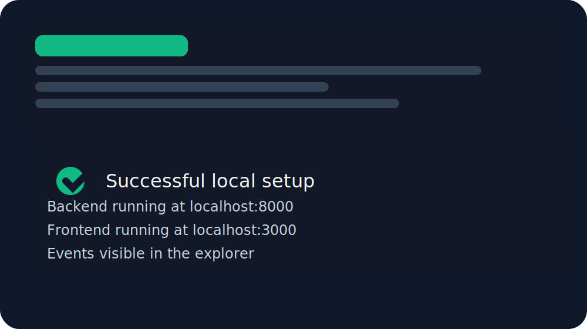

# Developer Onboarding Guide

This guide is designed to get a new SoroScan developer from zero to first contribution in under 2 hours.
It includes local setup, running the full stack, understanding the codebase, and submitting your first PR.

> If you prefer a quick local start, use the Docker Compose path in Section 3.

## 1. Prerequisites

Install the following tools on your machine:

1. Python 3.12+
2. Node.js 18+
3. Docker Engine and Docker Compose
4. Git

Open a terminal and confirm versions:

```bash
python --version
node --version
docker --version
docker compose version
git --version
```

### Recommended Platform
- Linux or macOS: easiest for local services and `docker compose`
- Windows: use WSL 2 for best compatibility with Docker and Python virtual environments

## 2. Fork and Clone the Repository

1. Fork the `SoroScan/soroscan` repository in GitHub.
2. Clone your fork:

```bash
git clone https://github.com/<your-username>/soroscan.git
cd soroscan
```

3. Add the upstream remote:

```bash
git remote add upstream https://github.com/SoroScan/soroscan.git
git fetch upstream
```

4. Create a working branch for your first change:

```bash
git checkout -b feat/onboarding-first-contribution
```

## 3. Environment Setup

SoroScan is a polyrepo with:
- `django-backend/` for API and ingestion
- `soroscan-frontend/` for the customer-facing explorer
- `admin/` for the admin dashboard
- `soroban-contracts/` for the Soroban smart contracts
- `sdk/` for Python and TypeScript SDK packages

### 3.1 Quick Start with Docker Compose

The fastest local setup is the repository root Docker Compose stack.

```bash
docker compose up --build
```

Open a second terminal and verify the stack:

```bash
docker compose ps
```

Then visit:
- Backend: `http://localhost:8000`
- Frontend explorer: `http://localhost:3000`

### 3.2 Backend Setup (Django)

```bash
cd django-backend
python -m venv .venv
source .venv/bin/activate
pip install -r requirements.txt
cp .env.example .env
```

Edit `django-backend/.env` and confirm the local database and Redis values.
If you use Docker Compose, the default values inside the `web` service are already configured.

Run migrations:

```bash
python manage.py migrate
```

Start the backend locally:

```bash
python manage.py runserver
```

### 3.3 Frontend Setup

```bash
cd ../soroscan-frontend
pnpm install
```

If the frontend needs generated GraphQL types, run:

```bash
GRAPHQL_ENDPOINT=http://localhost:8000/graphql/ pnpm run codegen
```

Start the frontend:

```bash
pnpm run dev
```

### 3.4 Admin Dashboard Setup

```bash
cd ../admin
npm install
npm run dev
```

By default the admin app will run on ports beginning at `3001`.

### 3.5 Smart Contract Setup

```bash
cd ../soroban-contracts/soroscan_core
cargo test
cargo build --target wasm32-unknown-unknown --release
```

If you are only working on backend or frontend features, you can skip contract compilation for your first contribution.

## 4. Running the Full Stack Locally

### Option A: Docker Compose full stack

From the repository root:

```bash
docker compose up --build
```

### Option B: Manual local services

1. Start PostgreSQL and Redis manually.
2. Start the backend: `python manage.py runserver`
3. Start the frontend: `pnpm run dev`
4. Start the admin dashboard: `npm run dev`

### Verify the stack

Open these URLs:
- `http://localhost:8000/ready` should return `200 OK`
- `http://localhost:3000` should show the SoroScan explorer



### You should see events in the explorer

If the stack is healthy, open the explorer and verify at least one event row appears.
If the explorer did not load or no events appear, continue to Section 12 for troubleshooting.

## 5. Project Structure Walkthrough

### `django-backend/`
- `manage.py` — Django command-line entrypoint
- `requirements.txt` — Python dependencies
- `soroscan/` — Django project and apps
- `soroscan/ingest/` — ingestion models, serializers, views, GraphQL schema, tests
- `soroscan/ingest/tests/` — backend unit and integration tests

### `soroscan-frontend/`
- `package.json` — frontend dependencies and scripts
- `app/` — Next.js app routes and pages
- `src/` — shared UI components and GraphQL helpers
- `generated/` — generated GraphQL types
- `GRAPHQL_CODEGEN_SETUP.md` — how to regenerate GraphQL types

### `admin/`
- `package.json` — admin dashboard dependencies
- `app/` — admin dashboard source code and pages
- `components/` — reusable admin UI components

### `soroban-contracts/`
- `soroscan_core/` — Rust smart contract that emits indexed events
- `Cargo.toml` — Rust package configuration

### `sdk/`
- `python/` — Python SDK package
- `typescript/` — TypeScript SDK package
- `README.md` — SDK usage and contribution references

### `docs/`
- `getting-started.md` — user-focused onboarding for SDKs and API
- `deployment/` — deployment and Docker Compose guides
- `api-reference/` — generated OpenAPI/API docs

## 6. Understanding the Codebase

### Finding feature code

1. Use repository search for keywords such as `event_type`, `filter`, `graphql`, or `Celery`.
2. Start from the user-facing feature and follow the call chain.

Example: event filtering
- Backend model: `django-backend/soroscan/ingest/models.py`
- Backend view filters: `django-backend/soroscan/ingest/views.py`
- GraphQL query handling: `django-backend/soroscan/ingest/schema.py`
- Frontend filter UI: `soroscan-frontend/app/dashboard/components/FilterBar.tsx`
- Frontend timeline filter: `soroscan-frontend/components/ingest/TimelineView.tsx`

### Finding tests

- Backend tests: `django-backend/soroscan/ingest/tests/`
- Frontend tests: `soroscan-frontend/__tests__/` and `soroscan-frontend/app/`
- Contract tests: `soroban-contracts/soroscan_core/`

Search for `.test.py`, `.spec.ts`, or `.test.tsx` when you need related coverage.

### Finding configuration

- Django settings: `django-backend/soroscan/settings.py`
- Backend environment: `django-backend/.env.example`
- Frontend environment: `soroscan-frontend/.env` if present or `next.config.ts`
- Admin environment: `admin/package.json`
- Docker Compose: `docker-compose.yml`

### Code style and conventions

- Python: PEP 8, `black`, `ruff`
- TypeScript/React: `pnpm lint`, `pnpm test`
- Rust: `cargo fmt`, `cargo clippy`
- Git commits: use clear scopes such as `feat:`, `fix:`, `docs:`

## 7. Git Workflow

1. Keep `main` in sync:

```bash
git fetch upstream
git checkout main
git merge upstream/main
```

2. Create a feature branch:

```bash
git checkout -b feat/describe-your-change
```

3. Commit often with focused changes.
4. Push your branch to your fork:

```bash
git push origin feat/describe-your-change
```

5. Open a PR against `main`.

## 8. Making Your First Contribution

### Pick a beginner issue

- Check for issues labeled `good-first-issue`.
- If `ALT_ISSUES.md` exists at the repository root, review it for starter tasks.
- If you are unsure, ask a maintainer in the issue comments.

### Example first contribution flow

1. Choose a small bug or documentation issue.
2. Reproduce the issue locally in the full stack.
3. Edit the code and run a focused test.
4. Commit the change with a concise message.
5. Push your branch and open a PR.

### Before you start coding

- Ensure your local `main` branch is current.
- Pick one small scope for your first change.
- Add an issue comment: **"I’d like to work on this."**

## 9. Testing Guide

### Backend tests

```bash
cd django-backend
source .venv/bin/activate
pytest
```

or

```bash
python manage.py test
```

### Frontend tests

```bash
cd soroscan-frontend
pnpm install
pnpm test
```

### Contract tests

```bash
cd soroban-contracts/soroscan_core
cargo test
```

### Writing a simple unit test

1. Find the component or function you changed.
2. Add a new test file or extend an existing one.
3. Run the targeted test case.
4. Confirm it passes before pushing.

### Coverage expectations

- There is no strict numeric requirement, but every bug fix or feature should include a regression test.
- For docs or process-only PRs, validate the steps and links rather than code coverage.

## 10. Submitting a PR

Use this checklist before opening a pull request:

- [ ] My branch is based on up-to-date `main`
- [ ] I ran relevant tests locally
- [ ] I included a clear PR title and description
- [ ] I linked the issue I am solving
- [ ] I added any required migration files
- [ ] I followed the repo’s code style

### PR title examples

- `feat: add event filter dropdown to explorer`
- `fix: resolve backend event query bug`
- `docs: add onboarding guide`

### PR description

- What changed
- Why it was needed
- How to verify locally
- Link to issue or discussion

## 11. Troubleshooting Guide

### Common setup errors

#### PostgreSQL connection issues
- Confirm the database process is running on `5432`.
- Confirm `DATABASE_URL` points to the right host and port.
- In Docker Compose, run:

```bash
docker compose logs db
```

#### Redis connection issues
- Confirm Redis is running on `6379`.
- In Docker Compose, run:

```bash
docker compose logs redis
```

#### Port conflicts
- Common ports: `5432`, `6379`, `8000`, `3000`, `3001`
- If a port is already in use, stop the conflicting service or change the mapping in `docker-compose.yml`.

#### `npm` / `pnpm` dependency conflicts
- Delete `node_modules` and reinstall:

```bash
rm -rf node_modules
pnpm install
```

- If you see lockfile mismatch errors, do not commit a changed lockfile unless you updated dependencies intentionally.

### Reset database

If the local database is inconsistent, use the helper script:

```bash
./scripts/reset.sh
```

### When the explorer does not show events

1. Verify the backend is healthy at `http://localhost:8000/ready`
2. Confirm the frontend is running at `http://localhost:3000`
3. Inspect the backend logs for ingestion errors
4. Restart the stack if needed

## 12. IDE Configuration

### VS Code
Recommended extensions:
- Python
- Pylance
- ESLint
- Tailwind CSS IntelliSense
- Rust Analyzer
- Docker

### PyCharm
- Use the Python interpreter from `django-backend/.venv`
- Enable Django support and set `manage.py` as the run configuration

### Debugging locally

#### Django
- Set a run configuration for `manage.py runserver`
- Use breakpoints inside `django-backend/soroscan/ingest/`

#### Next.js
- Use `pnpm run dev` in `soroscan-frontend`
- Attach the debugger to `http://localhost:3000`

## 13. Where to Ask for Help

- Open an issue or comment on an existing issue
- Ask in the project discussions or chat if available
- If you are blocked by setup, include your local log output and the commands you used
